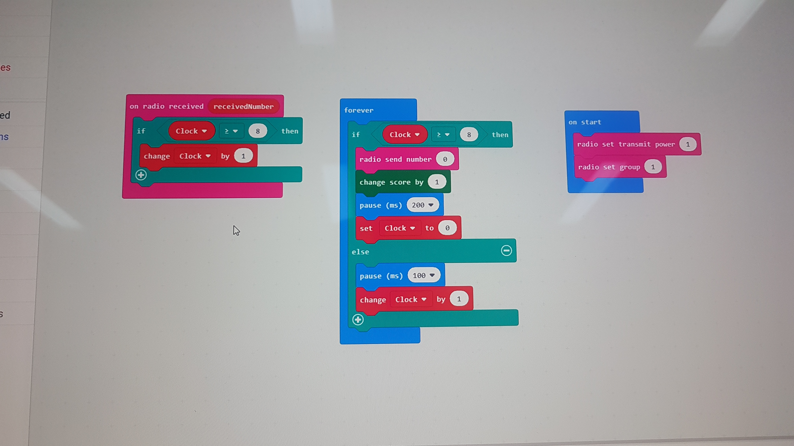
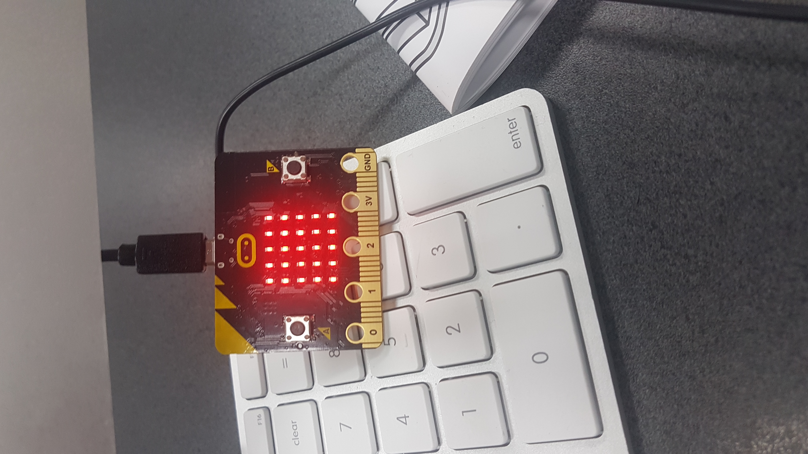
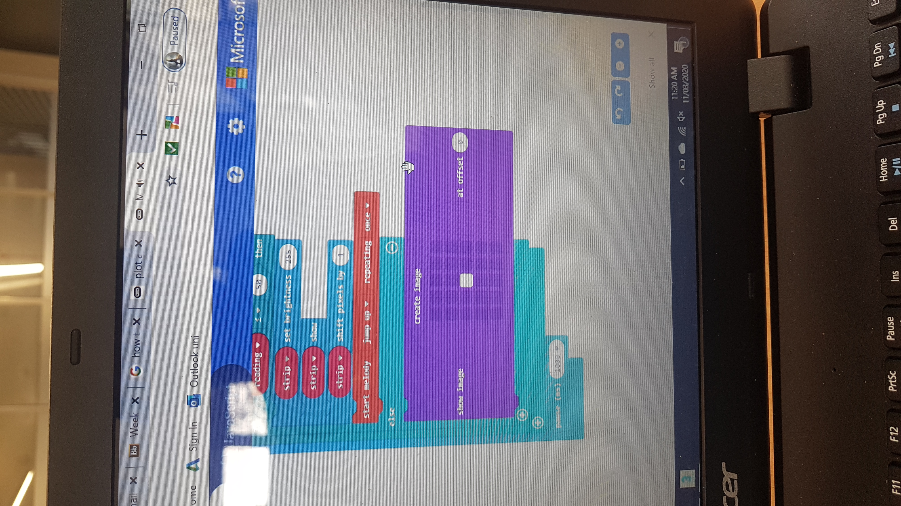
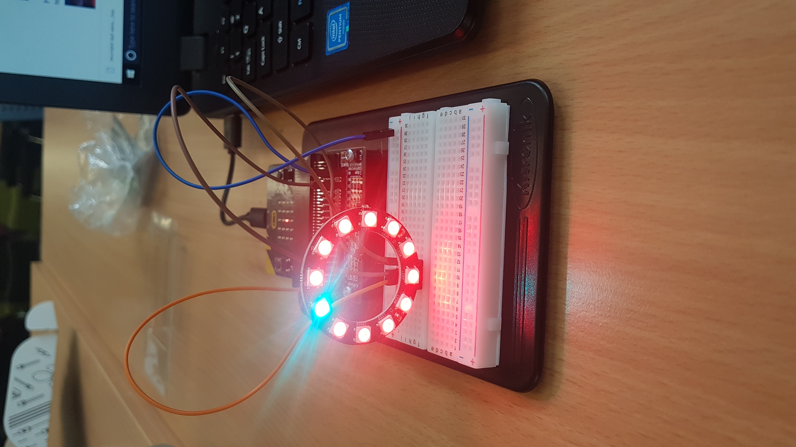
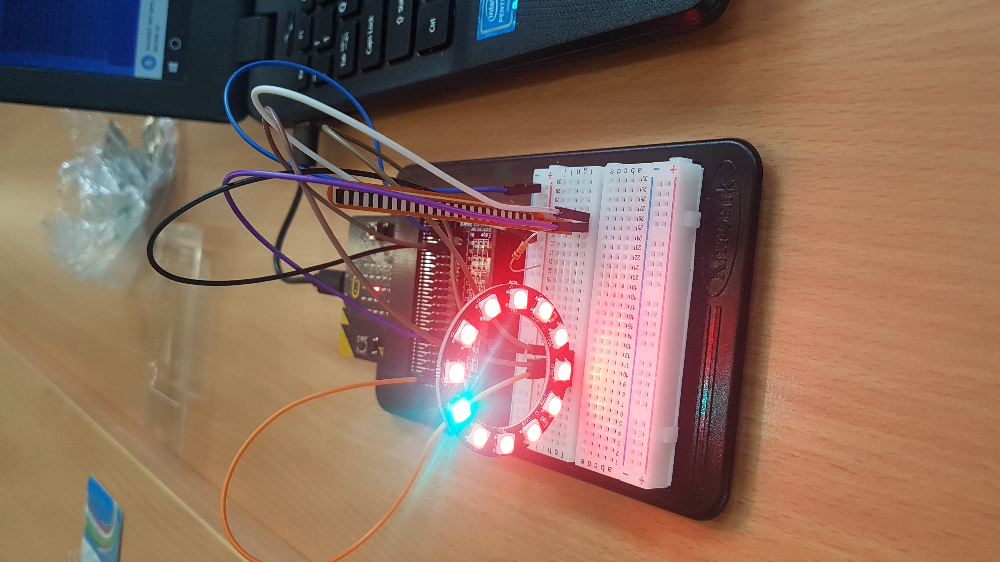
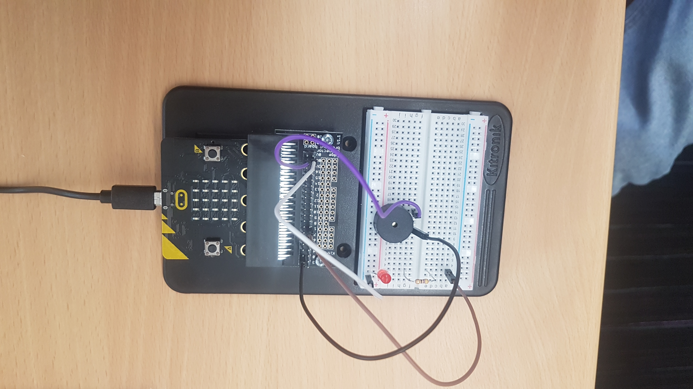
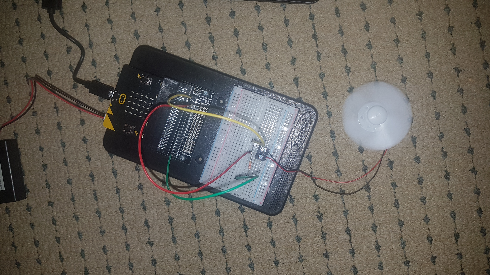
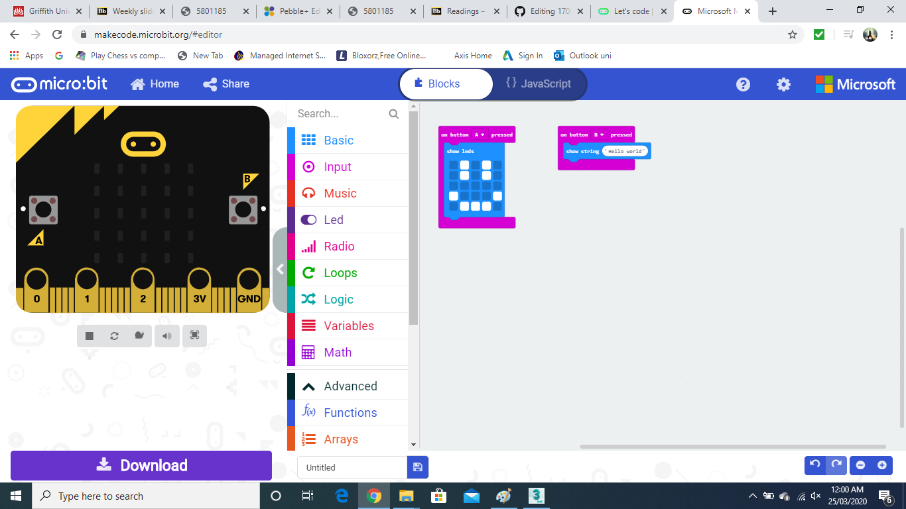
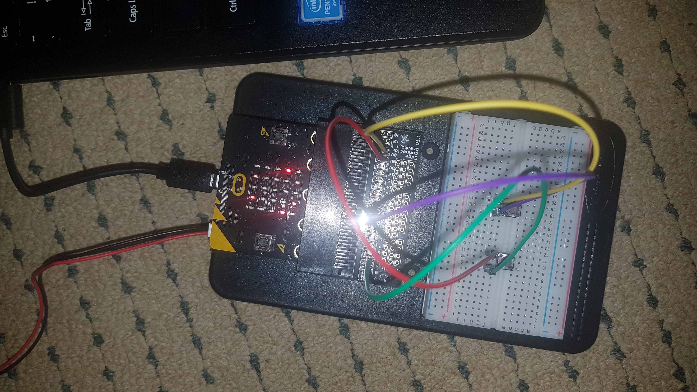

# Inventor Kit Experiments

*Markdown reference: https://guides.github.com/features/mastering-markdown/*

## Instructions ##

*For a selection of 5 inventor kit experiments that you choose, fill out the following sections.

### Experiment name ###

Firefly Experiment

#### Photo of completed project ####
*In the code below, replace `missingimage.png` with the name of the image, which should be in the `kitexperiments` folder.*

This experiment is the bluetooth firefly experiment which is used to create a firefly look to the microbit and connnect with others so they can do it simultaneously with other microbits. 

#### Reflection ####

In this experiment, something new to me was or something I learned was? I learned that microbits can emit a signal to other microbits.  

This experiment could be the basis of a real world application such as? Flashing lights for morse code or a light display of some sorts.

### Experiment name ###

Led with strip

#### Photo of completed project ####
In the code below, replace imagemissing.jpg with the name of the image, which should be in the kitexperiments folder.

The above images show the experiment with it's code and how it works

#### Reflection ####

In this experiment, something new to me was or something I learned was? I learned that you can control the led strip with the band so that it can display different colours even a rainbow. 

This experiment could be the basis of a real world application such as? It can be for lighting effects or even a runway lighting strips so that airplanes can see where they are landing. 

### Experiment name ###

Led with speaker

#### Photo of completed project ####
In the code below, replace imagemissing.jpg with the name of the image, which should be in the kitexperiments folder.

In this experiment the led blinks on and off whilst making a buzzing noise 

#### Reflection ####

In this experiment, something new to me was or something I learned was? Coding this made me learn that alot can happen in sync by coding them all properly and making sure they are all connected correctly. 

This experiment could be the basis of a real world application such as? It can be used as an alarm

### Experiment name ###

Using a transister to drive a motor

#### Photo of completed project ####
In the code below, replace imagemissing.jpg with the name of the image, which should be in the kitexperiments folder.

This experiment has a fan accelerate when started

#### Reflection ####

In this experiment, something new to me was or something I learned was? Something new i learned was you can add different rotary machines to your microbit and can experiment with about anything

This experiment could be the basis of a real world application such as? This can be used for an automated fan, obviously on a much larger scale or even a small portable one. 

### Experiment name ###

Say "hello" to the BBC microbit

#### Photo of completed project ####
In the code below, replace imagemissing.jpg with the name of the image, which should be in the kitexperiments folder.

In this experiment i displayed an image and a phrase

#### Reflection ####

In this experiment, something new to me was or something I learned was? I learned that we can display different images and words or phrases that the user can read and interact with. 

This experiment could be the basis of a real world application such as? This experiment can be used to communicate different images to users for different occasions such as deaf or just to display a message to the user/ reader. 

