# Assessment 1: Replication project

*Fill out the following workbook with information relevant to your project.*

*Markdown reference:* [https://guides.github.com/features/mastering-markdown/](http://guides.github.com/features/mastering-markdown/)

## Replication project choice ##
Banana Keyboard

## Related projects ##
*Find about 6 related projects to the project you choose. A project might be related through  function, technology, materials, fabrication, concept, or code. Don't forget to place an image of the related project in the* `replicationproject` *folder and insert the filename in the appropriate places below. Copy the markdown block of code below for each project you are showing, updating the number* `1` *in the subtitle for each.*

### Related project 1 ###
Musical Guitar

https://makecode.microbit.org/courses/csintro/arrays/project

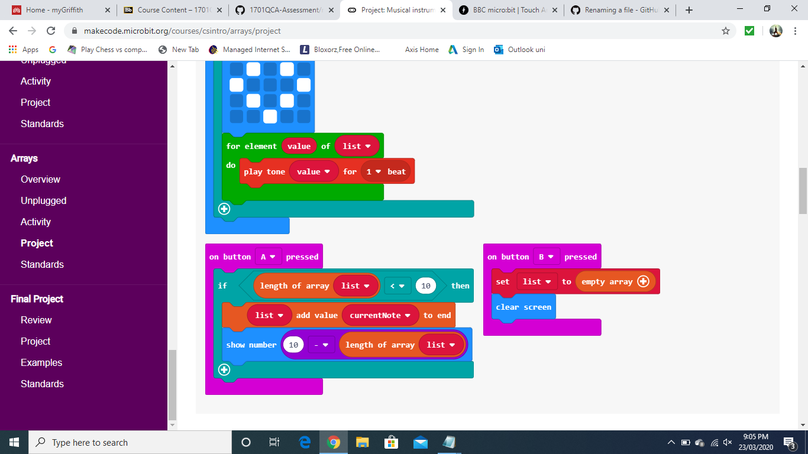

This project is related to mine because the code is similar to the code i will have to write, which is about playing different musical notes or songs when a button is pressed. It also has the same concept of using musical side to the code rather than just a display project. This project uses acceleration and different buttons to change the musical note. I can use similar code to code the microbit so that when it recieves information saying the fruit is being touched then it can play a musical rhythm or sound.  

### Related project 2 ###

Touch Arpeggiator

https://make.techwillsaveus.com/microbit/activities/touch-arpeggiator

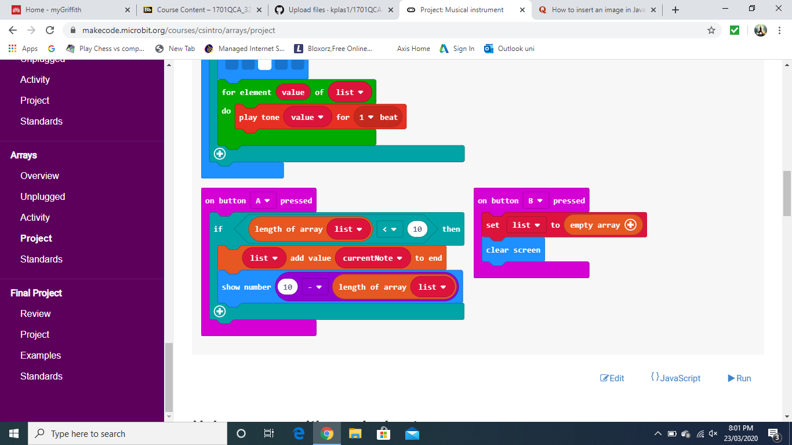

The Project displayed above is a similar project to the one i will be replicating, as it uses a similar concept with the fruit and how they use it to send a signal to the microbit to either display an image or create a sound. Using a banana and a apple or orange i can create a link to the microbit so when it recieves that someone it touching the fruit it will play a sound. 

### Related project 3 ###
Breadboard Layout

https://learn.adafruit.com/micro-bit-lesson-2-controlling-leds-on-breadboard/breadboard-layout

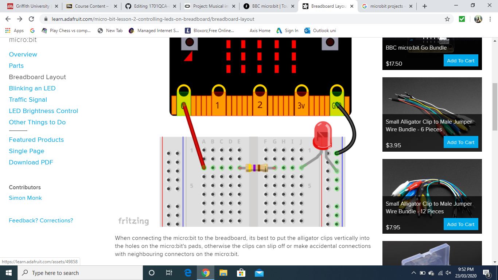

This project is related to the prject that i will be replicating as it uses a breadboard to hook up the wires to the microbit rather than using actual crocodile clippers to connect directly to the microbit. Using a breadboard i will be able to create a link to the microbit without using actual crocodile clips. 

### Related project 4 ###
Theremin

https://www.element14.com/community/community/stem-academy/microbit/blog/2018/12/21/project-bbc-microbit-light-theremin-by-cabe 

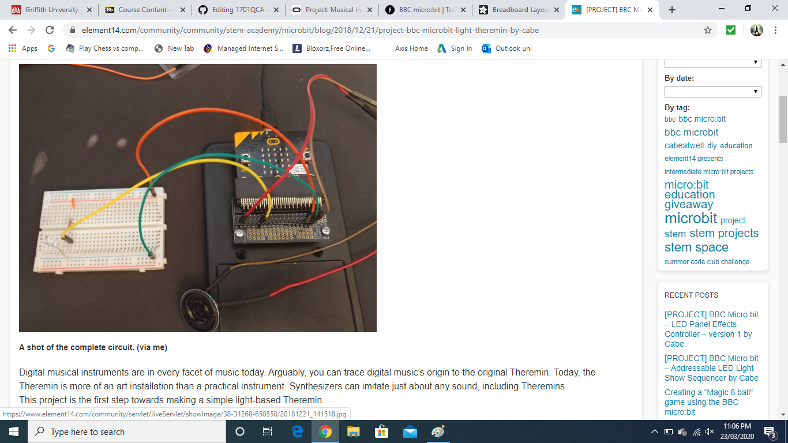

This project uses the some of the same electronics tht i will be using which is the breadboard, microbit and the wires. I will be using the same equipment as this project uses just with fruit that will act as sensors. It also will have a similar flow for my chart that shows what is all connected and which recieves and sends. This project is more of a final visual look of what my microbit, breadboard and wiring will look like in the end.

### Related project 5 ###
Lines

https://youtu.be/hP36xoPXDnM

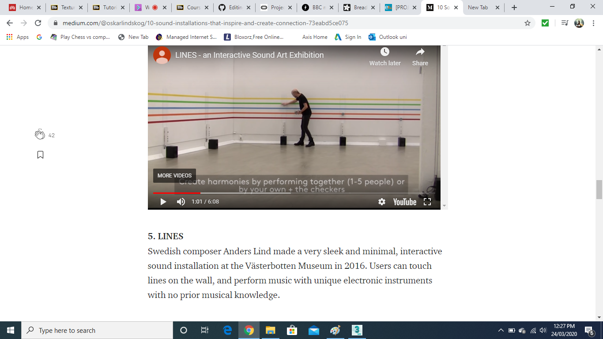

This project is fairly similar to the project tha i am replicating just on a much larger scale. This project uses the touch sensors to play a musical note and if you raise your hand it raises the pitch. The technology behind this project is advanced as it uses different sensors and wiring behind it. Overall this project uses a similar concept just on a much larger scale.

### Related project 6 ###
Sonic Police Weapon

https://news.artnet.com/art-world/12-sound-artists-changing-perception-art-587054

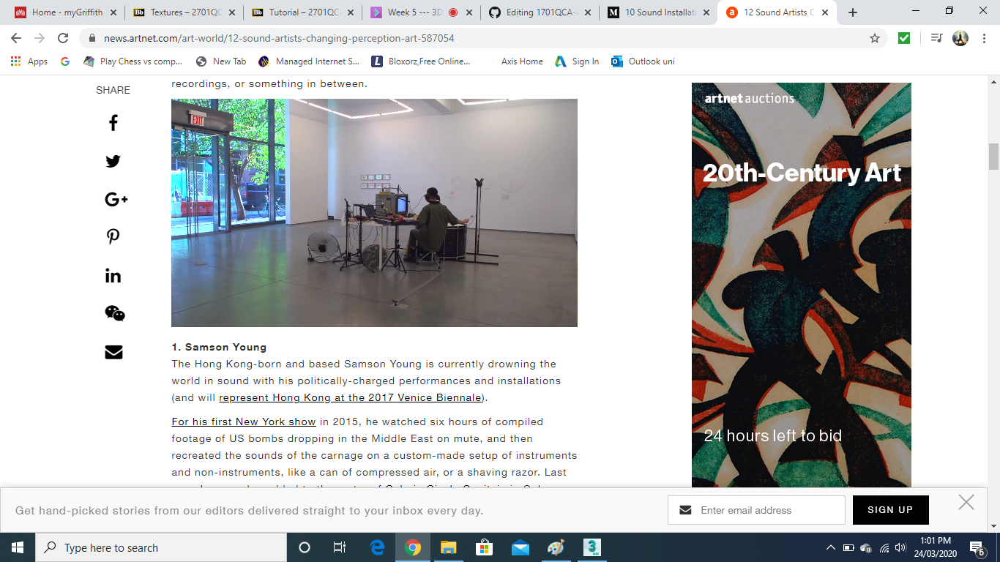

This project can relate to my project as i can use different sounds to mimic different scenarios which can crate an image in the users head. Of course this would be fairly difficult as the user must know what these sounds are from or mean so that they can create a image in their head. I got this idea because in the video he creates the sounds based off a video but if hat were to be reversed and were to jsut hear the sounds, someone can create a image in the head of what is going on which in this case would be a warzone. 

## Reading reflections ##
*Reflective reading is an important part of actually making your reading worthwhile. Don't just read the words to understand what they say: read to see how the ideas in the text fit with and potentially change your existing knowledge and maybe even conceptual frameworks. We assume you can basically figure out what the readings mean, but the more important process is to understand how that changes what you think, particularly in the context of your project.*

*For each of the assigned readings, answer the questions below.*

### Reading: Don Norman, The Design of Everyday Things, Chapter 1 (The Psychopathology of Everyday Things) ###

*What I thought before: Describe something that you thought or believed before you read the source that was challenged by the reading.*
I thought that the affordance would be something not needed, but infact it is very important for designs.

*What I learned: Describe what you now know or believe as a result of the reading. Don't just describe the reading: write about what changed in YOUR knowledge.*
I learned that the affordance is a very important thing that should be implemented into a project. This is because alot of designers know that the user does not know what they are thinking and why they created guides (affordances and signifiers) for something. That is what alot of beginners miss when creating a project, is that they create something that obviously means something but to the user it means nothing. That is why signifiers and affordances need to be implemented to guide the user to what they need to do and how they can interact or understand what the designer is telling them to do. 

*What I would like to know more about: Describe or write a question about something that you would be interested in knowing more about.*
I would like to know on how far does it need to go before there is too much information that can confuse the user? For example a designer create a project for something and can be interacted with, but obviously the user needs to know whats going on without getting handed the entire manual full of code that they don't understand. So when is too much information for the user? because designers want to make it as easy as possible to use. 

*How this relates to the project I am working on: Describe the connection between the ideas in the reading and one of your current projects or how ideas in the reading could be used to improve your project.*
This relates to my project as alot of users when looking at my project will be slightly confused s there is a bunch or wiring from a banana to a random piece of technology. Then again my project will lead the user to curiosity and will likley end up touching the banana to see what it does. Other than that there should be a message written or displayed that shows 'press on banana' or 'touch fruit' so it can direct the user to what they can do with the project. 

### Reading: Chapter 1 of Dan Saffer, Microinteractions: Designing with Details, Chapter 1 ###

*What I thought before: Describe something that you thought or believed before you read the source that was challenged by the reading.*
I thought that microinteractions would be little things you could play with or use which is correct but i thought that people will use them less and only if it was necessary. 

*What I learned: Describe what you now know or believe as a result of the reading. Don't just describe the reading: write about what changed in YOUR knowledge.*
What changed was that i now know that, Microinteractions are everywhere and we use them all the time, from literally everything. They are used in almost every technology as stated in the chapter "it is the glue that holds the product together". This is true as without the little microinteractions the product would be alot difficult to use, because we are so used to it being there for example the translate option on facebook. We don't really notice it unless we want to and if it is not there we will begin to notice and wonder why it is not there. 

*What I would like to know more about: Describe or write a question about something that you would be interested in knowing more about.*
A question i would like to know is, is there a product that can be used easily without a microinteraction? But it is not a microinteraction itself similar to the toaster example in the chapter, saying that the whole thing revolves around a microinteraction as it only does one thing and thats all we see it as.

*How this relates to the project I am working on: Describe the connection between the ideas in the reading and one of your current projects or how ideas in the reading could be used to improve your project.*
The ideas in the reading relate to my project as there are little microinteractions that are in the project, such as the connections to the microbit to the breadboard seeing as it should work when actually it could not and will need to be elaborated on to make it work. These little microinteractions need to be implemented or as said before the product will be harder to use as the user thinks that it should do it straight away no questions asked. 

### Reading: Scott Sullivan, Prototyping Interactive Objects ###

*What I thought before: Describe something that you thought or believed before you read the source that was challenged by the reading.*
I thought that designing a project wouldn't need as much visual representation and communication but the project revolves around that visual representation and communication alot. 

*What I learned: Describe what you now know or believe as a result of the reading. Don't just describe the reading: write about what changed in YOUR knowledge.*
I now know that the code is very important as it is the thing that helps communicate with the microbit and the sensors. This is very important as it is the bridge that allows the information that the sensor is getting to go to the microbit which will then create something else. This can be used for any way of getting data for example in the reading he states that he implemented a infrared camera into a store to detect physical movement to census the amount of people whom walk into the store.  

*What I would like to know more about: Describe or write a question about something that you would be interested in knowing more about.*
I would be intrested in knowing on how in the example in the reading, he could've detected how many people go in without it detecting all the people walking out of the shop. 

*How this relates to the project I am working on: Describe the connection between the ideas in the reading and one of your current projects or how ideas in the reading could be used to improve your project.*
This relates to my project because i need my sensor to detect the right information to send to the microbit, being that it needs to know when a banana is being touched and what to play afterwoods. 

## Interaction flowchart ##
*Draw a flowchart of the interaction process in your project. Make sure you think about all the stages of interaction step-by-step. Also make sure that you consider actions a user might take that aren't what you intend in an ideal use case. Insert an image of it below. It might just be a photo of a hand-drawn sketch, not a carefully drawn digital diagram. It just needs to be legible.*

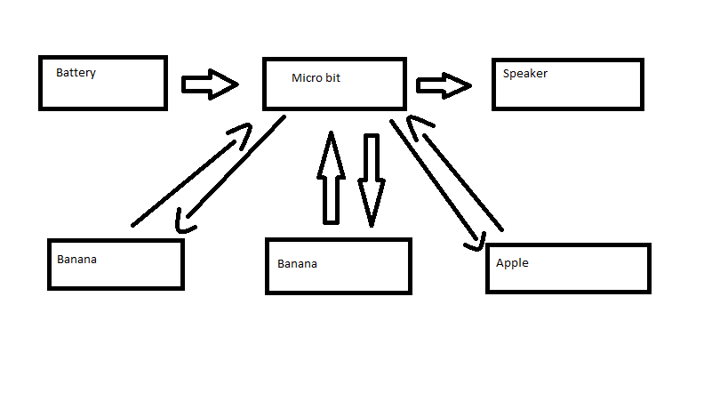

The flowchart represents what interacts with what. The battery is connected to the microbit which is connected to the speaker. The microbit recieves the information from the apple and banana when they have been touched and when the microbit recieves that information it sends to the speaker to play a tune or note. 

## Process documentation

*In this section, include text and images that represent the development of your project including sources you've found (URLs and written references), choices you've made, sketches you've done, iterations completed, materials you've investigated, and code samples. Use the markdown reference for help in formatting the material.*

*This should have quite a lot of information!*

*There will likely by a dozen or so images of the project under construction. The images should help explain why you've made the choices you've made as well as what you have done. Use the code below to include images, and copy it for each image, updating the information for each.*

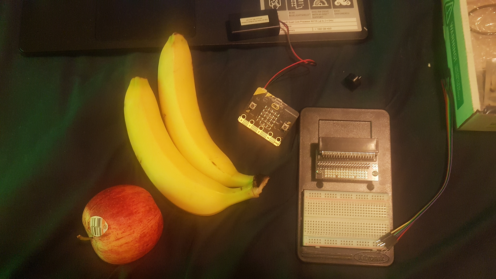

This image displays the materials i will be using for my assignment which are the 2 bananas, apple, microbit, breadboard, speaker, battery and wiring. ^^

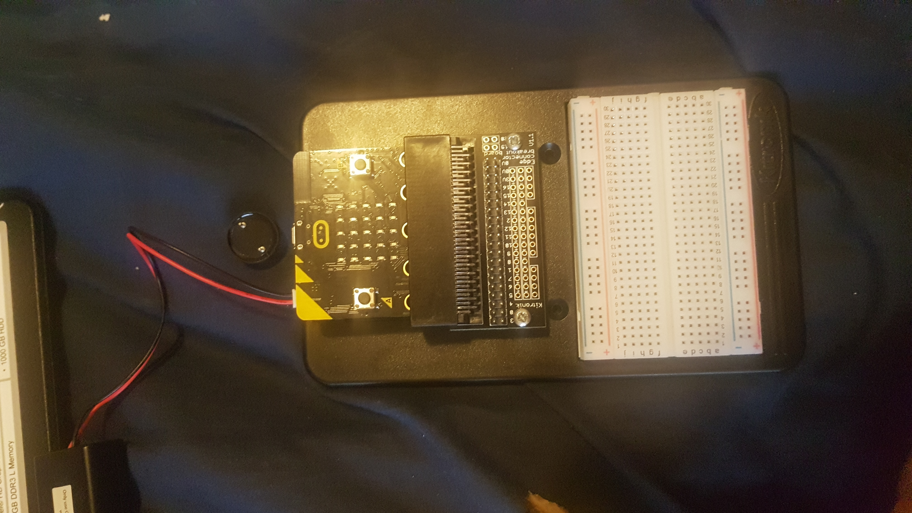

This image displays me assembling the breadboard with the microbit ^^

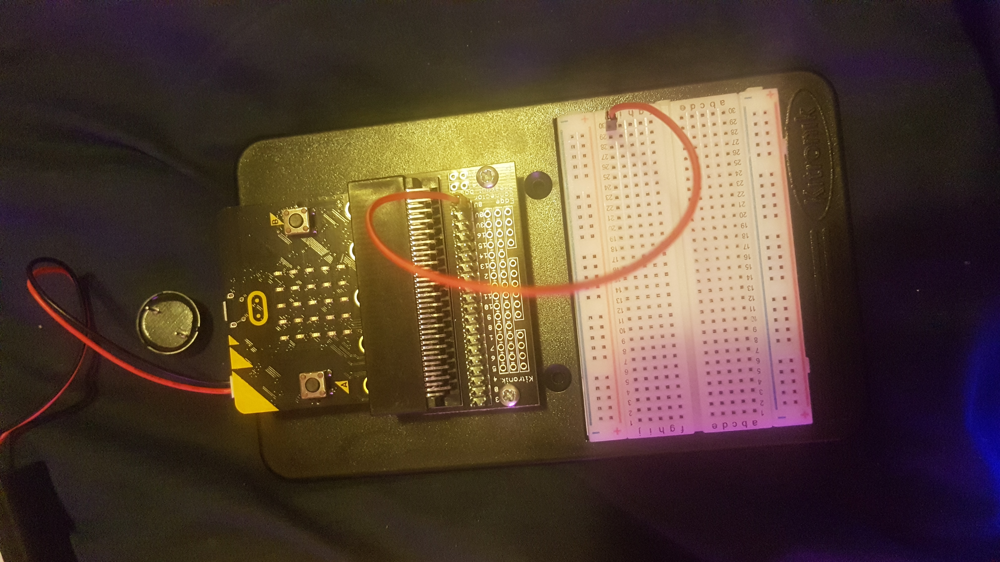

This image displays the wiring that is starting to be implemented and the battery being attached. ^^

This image shows the wiring being implemented to the speaker and the bananas and apple being hooked up to the pins, grounds and voltage. ^^ 

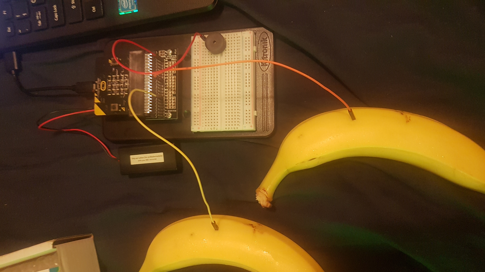

This is the completed look of the project. With the apple on the right, 2 bananas on the left with the microbit and breadboard in the middle. ^^

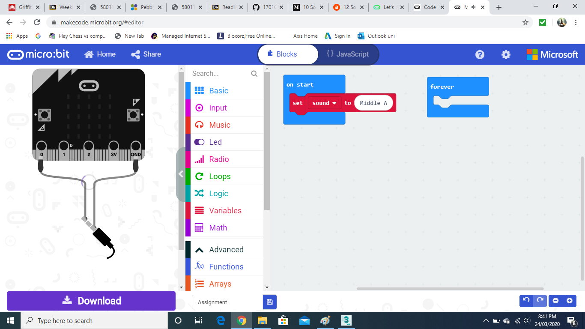

This image displays the starting of the code, where i clarify the on start noise ^^

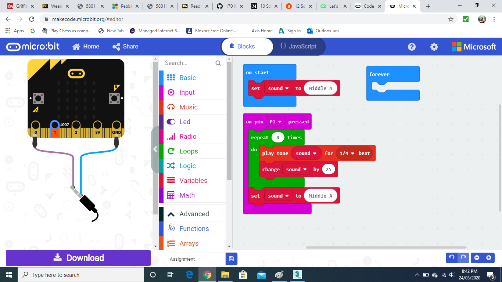

This image shows me adding the p1 attributes and adding the output tone ^^

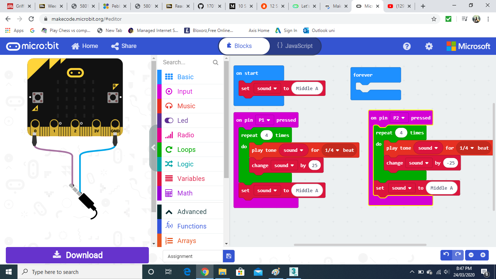

This image displays me elaborating a bit more on the code and adding p2 and its attributes ^^

This is what was the originally the final code displaying both p1 and p2 attributes. ^^

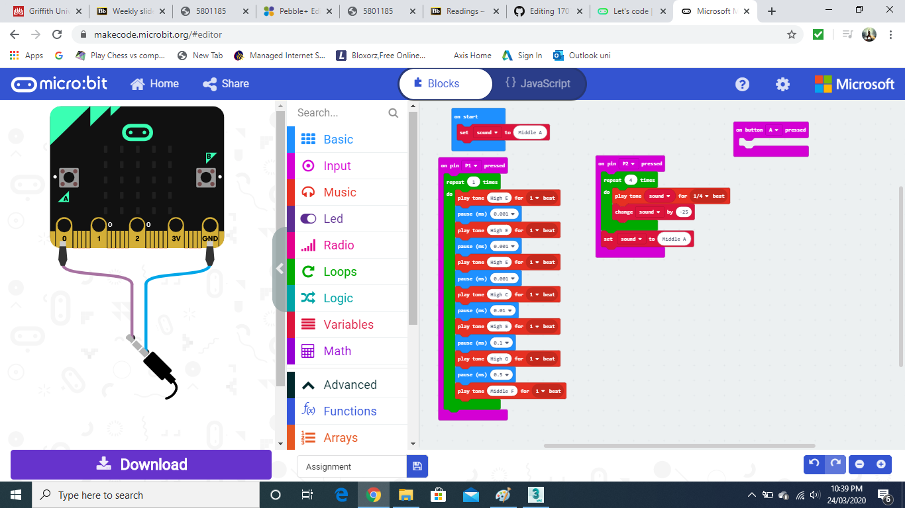

This image displays my completed code for my project ^^

*Include screenshots of the code you have used.*

## Project outcome ##

*Complete the following information.*

### Project title ###
Banana Keyboard

### Project description ###

*In a few sentences, describe what the project is and does, who it is for, and a typical use case.*
The project is a keyboard in a way using fruits, this is used by sending a current through the apple which will go through the user and when touched on one of the bananas will play a tune or note. 

### Showcase image ###

*Try to capture the image as if it were in a portfolio, sales material, or project proposal. The project isn't likely to be something that finished, but practice making images that capture the project in that style.*

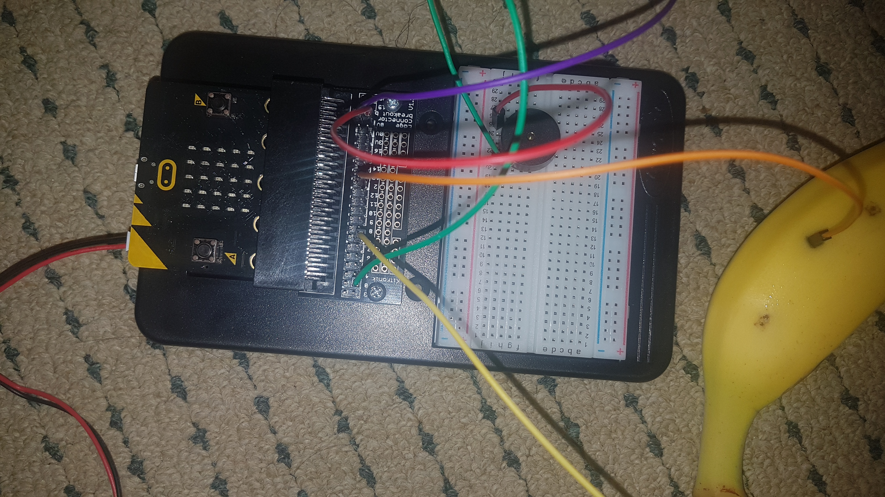

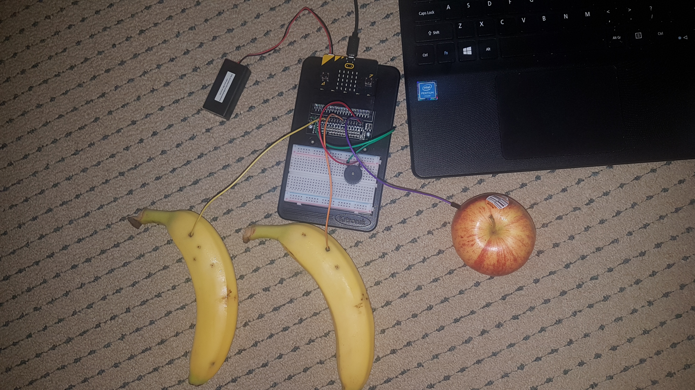

### Additional view ###

*Provide some other image that gives a viewer a different perspective on the project such as more about how it functions, the project in use, or something else.*

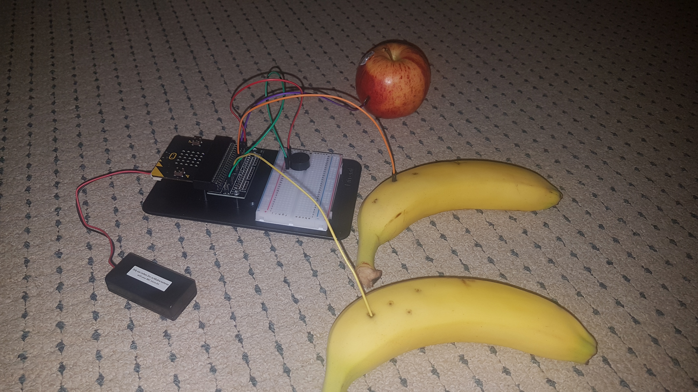

### Reflection ###

*Describe the parts of your project you felt were most successful and the parts that could have done with improvement, whether in terms of outcome, process, or understanding.*
The parts that i found successful were the actual connection of the bananas and apple. At the start i found it pretty difficult to connect them to P1, P2 and ground on the breadboard. What i found out was the connections were not wired correctly and that i need an actual eletrical current. What i found challenging was mainly setting up the breadboard wires and some of the code. Mainly creating the song loop for P1 was rather hard as i needed it to be a shorter pause but it did not allow me to so i had to work with what i had been given. 

*What techniques, approaches, skills, or information did you find useful from other sources (such as the related projects you identified earlier)?*
I found that many of the readings helped me in regards to the flow of the system and how the different things interact with eachother and how the user interacts with the project. I found that one of the related projects (Lines) was fairly similar to mine just on a much larger and more advanced scale as he uses physical sensors to detect where his hand is and the pitch to play. 

*What ideas have you read, heard, or seen that informed your thinking on this project? (Provide references.)*
Well the Lines project was fairly similar to my project as it uses the same concept, detecting via a sensor and playing a musical sound when the sensor goes on. Other than that the project in the reading (Scott Sullivan, Prototyping Interactive Objects) he uses a thermal sensors to detect movement which sends to him information about how many people go into the store. This relates to my project in a way that the banana sends the information to the microbit saying the current is getting linked which signals the microbit to play a tune. It is just one big circut. 

*What might be an interesting extension of this project? In what other contexts might this project be used?*
A very good extension would be similar to the Lines project as said before it uses sensors to detect when and where a the hand is located and then it will transmit a sound. Obviously it will have to use much more advanced technology such as thermal sensors or ight sensors even to detect where the hand is place and when to raise the pitch.
