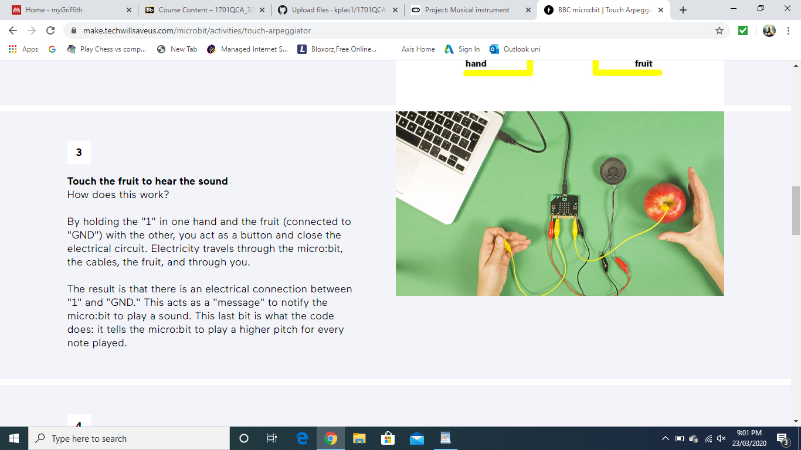

# Assessment 1: Replication project

*Fill out the following workbook with information relevant to your project.*

*Markdown reference:* [https://guides.github.com/features/mastering-markdown/](http://guides.github.com/features/mastering-markdown/)

## Replication project choice ##
Banana Keyboard

## Related projects ##
*Find about 6 related projects to the project you choose. A project might be related through  function, technology, materials, fabrication, concept, or code. Don't forget to place an image of the related project in the* `replicationproject` *folder and insert the filename in the appropriate places below. Copy the markdown block of code below for each project you are showing, updating the number* `1` *in the subtitle for each.*

### Related project 1 ###
Musical Guitar

https://makecode.microbit.org/courses/csintro/arrays/project

This project is related to mine because the code is similar to the code i will have to write, which is about playing different musical notes or songs when a button is pressed. It also has the same concept of using musical side to the code rather than just a display project. This project uses acceleration and different buttons to change the musical note. I can use similar code to code the microbit so that when it recieves information saying the fruit is being touched then it can play a musical rhythm or sound.  

### Related project 2 ###

Touch Arpeggiator

https://make.techwillsaveus.com/microbit/activities/touch-arpeggiator

The Project displayed above is a similar project to the one i will be replicating, as it uses a similar concept with the fruit and how they use it to send a signal to the microbit to either display an image or create a sound. Using a banana and a apple or orange i can create a link to the microbit so when it recieves that someone it touching the fruit it will play a sound. 

### Related project 3 ###
Breadboard Layout

https://learn.adafruit.com/micro-bit-lesson-2-controlling-leds-on-breadboard/breadboard-layout

This project is related to the prject that i will be replicating as it uses a breadboard to hook up the wires to the microbit rather than using actual crocodile clippers to connect directly to the microbit. Using a breadboard i will be able to create a link to the microbit without using actual crocodile clips. 

### Related project 4 ###
Theremin

https://www.element14.com/community/community/stem-academy/microbit/blog/2018/12/21/project-bbc-microbit-light-theremin-by-cabe 

This project uses the some of the same electronics tht i will be using which is the breadboard, microbit and the wires. I will be using the same equipment as this project uses just with fruit that will act as sensors. It also will have a similar flow for my chart that shows what is all connected and which recieves and sends. This project is more of a final visual look of what my microbit, breadboard and wiring will look like in the end.

### Related project 5 ###
Lines

https://youtu.be/hP36xoPXDnM

This project is fairly similar to the project tha i am replicating just on a much larger scale. This project uses the touch sensors to play a musical note and if you raise your hand it raises the pitch. The technology behind this project is advanced as it uses different sensors and wiring behind it. Overall this project uses a similar concept just on a much larger scale.

### Related project 6 ###
Sonic Police Weapon

https://news.artnet.com/art-world/12-sound-artists-changing-perception-art-587054

This project can relate to my project as i can use different sounds to mimic different scenarios which can crate an image in the users head. Of course this would be fairly difficult as the user must know what these sounds are from or mean so that they can create a image in their head. I got this idea because in the video he creates the sounds based off a video but if hat were to be reversed and were to jsut hear the sounds, someone can create a image in the head of what is going on which in this case would be a warzone. 

## Reading reflections ##
*Reflective reading is an important part of actually making your reading worthwhile. Don't just read the words to understand what they say: read to see how the ideas in the text fit with and potentially change your existing knowledge and maybe even conceptual frameworks. We assume you can basically figure out what the readings mean, but the more important process is to understand how that changes what you think, particularly in the context of your project.*

*For each of the assigned readings, answer the questions below.*

### Reading: Don Norman, The Design of Everyday Things, Chapter 1 (The Psychopathology of Everyday Things) ###

*What I thought before: Describe something that you thought or believed before you read the source that was challenged by the reading.*

*What I learned: Describe what you now know or believe as a result of the reading. Don't just describe the reading: write about what changed in YOUR knowledge.*

*What I would like to know more about: Describe or write a question about something that you would be interested in knowing more about.*

*How this relates to the project I am working on: Describe the connection between the ideas in the reading and one of your current projects or how ideas in the reading could be used to improve your project.*

### Reading: Chapter 1 of Dan Saffer, Microinteractions: Designing with Details, Chapter 1 ###

*What I thought before: Describe something that you thought or believed before you read the source that was challenged by the reading.*

*What I learned: Describe what you now know or believe as a result of the reading. Don't just describe the reading: write about what changed in YOUR knowledge.*

*What I would like to know more about: Describe or write a question about something that you would be interested in knowing more about.*

*How this relates to the project I am working on: Describe the connection between the ideas in the reading and one of your current projects or how ideas in the reading could be used to improve your project.*

### Reading: Scott Sullivan, Prototyping Interactive Objects ###

*What I thought before: Describe something that you thought or believed before you read the source that was challenged by the reading.*

*What I learned: Describe what you now know or believe as a result of the reading. Don't just describe the reading: write about what changed in YOUR knowledge.*

*What I would like to know more about: Describe or write a question about something that you would be interested in knowing more about.*

*How this relates to the project I am working on: Describe the connection between the ideas in the reading and one of your current projects or how ideas in the reading could be used to improve your project.*

## Interaction flowchart ##
*Draw a flowchart of the interaction process in your project. Make sure you think about all the stages of interaction step-by-step. Also make sure that you consider actions a user might take that aren't what you intend in an ideal use case. Insert an image of it below. It might just be a photo of a hand-drawn sketch, not a carefully drawn digital diagram. It just needs to be legible.*

## Process documentation

*In this section, include text and images that represent the development of your project including sources you've found (URLs and written references), choices you've made, sketches you've done, iterations completed, materials you've investigated, and code samples. Use the markdown reference for help in formatting the material.*

*This should have quite a lot of information!*

*There will likely by a dozen or so images of the project under construction. The images should help explain why you've made the choices you've made as well as what you have done. Use the code below to include images, and copy it for each image, updating the information for each.*

*Include screenshots of the code you have used.*

## Project outcome ##

*Complete the following information.*

### Project title ###

### Project description ###

*In a few sentences, describe what the project is and does, who it is for, and a typical use case.*

### Showcase image ###

*Try to capture the image as if it were in a portfolio, sales material, or project proposal. The project isn't likely to be something that finished, but practice making images that capture the project in that style.*

### Additional view ###

*Provide some other image that gives a viewer a different perspective on the project such as more about how it functions, the project in use, or something else.*

### Reflection ###

*Describe the parts of your project you felt were most successful and the parts that could have done with improvement, whether in terms of outcome, process, or understanding.*

*What techniques, approaches, skills, or information did you find useful from other sources (such as the related projects you identified earlier)?*

*What ideas have you read, heard, or seen that informed your thinking on this project? (Provide references.)*

*What might be an interesting extension of this project? In what other contexts might this project be used?*
